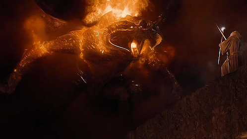

# 🔥 Kata: You Shall Not Pass! A Two Sum Problem-Solving Quest 🔥

### Help Gandalf defeat the Balrog by solving the <ins>Two Sum Problem</ins>.


The two sum software engineering problem is commonly found in junior developer interviews and tech tests. It falls under the category of algorithmic problems related to array processing. This code kata will teach you how to solve the two-sum problem, just in time for your next developer interview, and to save the "fellowship" from a scorching "Balrog barbecue"!

## 📜 Lore

Gandalf the Grey is engaged in a battle of epic proportions on the Bridge of Khazad-dûm, deep in the Mines of Moria. His arch-nemesis, the Balrog, is roaring, fire is blazing, and Gandalf is running out of clever one-liners. "You shall not pass!" is not cutting it anymore.

To save the day, he needs to combine exactly two of his magical spells to match the precise power needed to vanquish the Balrog. The spells are a bit quirky and have power levels represented by integers. Gandalf, being a wizard but not exactly a JavaScript developer, needs your help to figure out which two spells to use.

## 📋 Task

Given an array of integers representing the power levels of Gandalf's spells and an integer target representing the exact power needed to defeat the Balrog, you must find <ins>the indices</ins> of the two spells whose combined power matches the target. Remember, Gandalf can’t just wave his staff and magically know the answer—he’s counting on you!

## ✅ Requirements

#### 1. Function Signature

```
function findTwoSumIndices(numbers, target) {
  // Your code goes here
}
```

#### 2. Input

- An array "numbers" where each element is an integer, representing the magical power of each spell.
- An integer "target" which is the total power Gandalf needs.

#### 3. Output

- An array containing two integers.
- These integers are the indices of the numbers (a.k.a. the magical spell powers) that sum up to the target.
- **Return these two indices in an array to pass the test.**

#### 4. Constraints

- If there are multiple pairs of numbers whose sum meets the target, return the first pair found (hint: your code will probably do this automatically for you 😉).

## ✏️ Examples

```
findTwoSumIndices([2, 4, 6, 8], 10); // returns [0, 3] since 2 + 8 = 10
findTwoSumIndices([1, 3, 5, 7], 8);  // returns [0, 3] since 1 + 7 = 8
findTwoSumIndices([1, 2, 3, 4, 5], 9); // returns [3, 4] since 4 + 5 = 9
findTwoSumIndices([7, 5, 3, 1], 8); returns [0, 3] since 7 + 1 = 8
findTwoSumIndices([8, 4, 2, 6], 10); returns [0, 2] since 8 + 2 = 10
```

#### Explanations

##### In the first example

- Gandalf’s spell list is [2, 4, 6, 8].
- The target power is 10.
- The spell at index 0 has a power level of 2, and the spell at index 3 has a power level of 8.
- When these two spells combine their powers, they total 10, saving the day and proving Gandalf's wizardry isn’t just for show. The function returns [0, 3].

##### In the second example

- Gandalf’s spell list is [1, 3, 5, 7].
- The target is 8.
- The spell at index 0 has a power level of 1, and the spell at index 3 has a power level of 7.
- Combining these spells gives a total of 8, so the function returns [0, 3].

##### Further examples

- Additional examples (examples three to five) have been included for reference purposes.

## ⚔️ Over To You

**Now it's your turn to tackle this code kata and give it your best shot!**

Try to complete this on your own first. But if you get stuck you can always refer to the runes contained in the scroll of hints and scroll of solutions below.

> _"Fare thee well, Gandalf the Grey and noble companion, and may the light of your staff ever illuminate the darkest paths before you, and the blade of Glamdring strike true against all who threaten your quest!"_



## 🧙‍♂️ Hints

TODO - Complete this section.

## Solution

TODO - Complete this section.

---

## 📚 Additional Resources

TODO - link to installation/usage instructions, your plan document, and the original requirements README.md.

## TODOs

- Rename README.md to something else and then move the content of PROJECT_PRESENTATION TO README.md to make this file the main readme for your project. ✅
- There is a code commenting TODO left to complete at the top of main.js.
- Add an "installation" section to show how to get the project up and running.
- Add a collapsible (hidden by default) "hints" section with multiple layers of hints.
- Add a collapsible (hidden by default) "solution" section showcasing the final solution (as currently detailed in main.js).
- Create a PLANNING.MD document if there is time left. This should contain details above your ideation process, planning process, etc. ALSO LINK to this new PLANNING.md file in your new README.md file.
- IMPORTANT: Remember to delete your "solution" code from main.js and push everything (including this empty function) back up to GitHub.
- Run a manual end-to-end test of your entire project.
- Finally, reread the original requirements/objective in the original README.md file to make sure you've hit the brief.
